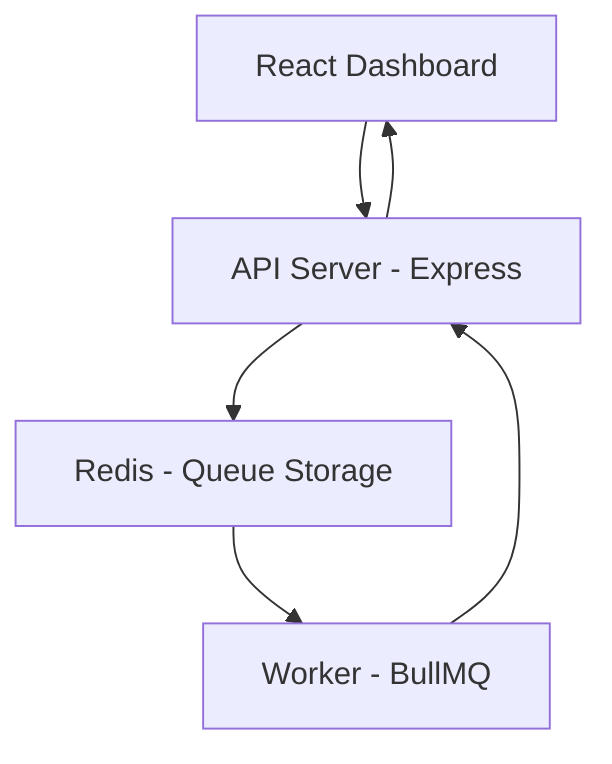

# 🚀 Distributed Job Queue System (Real-Time + Scalable)

> A **production-grade distributed job queue system** with **real-time monitoring dashboard**, built using **Node.js, BullMQ, Redis, and WebSockets** — inspired by architectures used at Uber, Zomato, and Amazon.

---

## 🚀 Live Demo – Distributed Job Queue System

🔗 Live Application: https://distributed-job-queue-1-cpw6.onrender.com
## 📌 Introduction

Modern applications require handling tasks asynchronously (emails, notifications, background processing).
This project demonstrates how to build a **scalable and fault-tolerant job processing system** with:

* ⚡ High-performance queue system
* 🔄 Background workers
* 📊 Real-time dashboard
* 📡 Event-driven architecture

---

## 🖥️ Admin Dashboard (Bull Board)
Real-time monitoring of job queue including:
- Active jobs
- Completed jobs
- Failed jobs
- Delayed jobs
- Logs & Error tracking
- 


## 📊 User Dashboard
Frontend interface built with React for:
- Adding new jobs
- Viewing job status
- Analytics & charts
- Retry failed jobs
- Queue controls
- 


## 🧠 System Architecture



---

## ✨ Key Features

### 🔹 Core System Features

* ✅ Distributed job queue using **BullMQ**
* ✅ Background job processing with **Worker service**
* ✅ Redis-based message broker
* ✅ REST API for job management

---

### 🔹 Real-Time Features

* 📡 WebSocket integration using **Socket.IO**
* ⚡ Instant UI updates (No polling)
* 🔔 Live toast notifications

---

### 🔹 Dashboard Features

* 📊 Live metrics (Total, Active, Completed, Failed)
* 📈 Bar + Pie chart analytics
* 📋 Job table with real-time status
* 🧾 Job detail modal
* 🔁 Retry failed jobs

---

### 🔹 Reliability & Security

* 🔄 Retry mechanism with backoff strategy
* ☠️ Dead Letter Queue (DLQ)
* 🛡️ Rate limiting (API protection)
* 🔐 Helmet security middleware
* ✅ Input validation (Joi)

---

## 🛠️ Tech Stack

### 🔹 Backend

* Node.js
* Express.js
* BullMQ
* Redis
* Socket.IO
* Joi
* Helmet
* Express Rate Limit

### 🔹 Frontend

* React.js
* Axios
* Chart.js
* Custom CSS UI

---

## 📂 Project Structure

```bash
distributed-job-queue/
│
├── server/
│   ├── index.js              # API Server
│   ├── socket.js             # WebSocket setup
│   ├── queue/
│   │   └── queue.js          # BullMQ queue
│   ├── worker/
│   │   └── worker.js         # Job processor
│   ├── config/
│   │   └── redis.js
│   ├── utils/
│   └── dashboard/
│
├── client/
│   ├── src/
│   │   ├── components/
│   │   │   ├── Metrics.jsx
│   │   │   ├── Charts.jsx
│   │   │   ├── JobTable.jsx
│   │   │   ├── Notification.jsx
│   │   │   └── ...
│   │   ├── App.jsx
│   │   ├── socket.js
│   │   └── App.css
│
└── README.md
```

---

## ⚙️ Installation & Setup

### 1️⃣ Clone Repository

```bash
git clone https://github.com/your-username/distributed-job-queue.git
cd distributed-job-queue
```

---

### 2️⃣ Backend Setup

```bash
cd server
npm install
```

Create `.env` file:

```env
PORT=5000
REDIS_URL=your_redis_connection_string
```

Run server + worker:

```bash
npm run dev
```

---

### 3️⃣ Frontend Setup

```bash
cd client
npm install
npm run dev
```

---

## 🚀 Usage Guide

### 🔹 Add Job

* Click **"Add Job"** button
* Job is pushed into Redis queue

### 🔹 Monitor Jobs

* View live updates in dashboard
* No manual refresh required

### 🔹 Retry Failed Jobs

* Click **Retry** button
* Job reprocessed instantly

---

## 📊 API Endpoints

| Method | Endpoint   | Description        |
| ------ | ---------- | ------------------ |
| GET    | /metrics   | Get system metrics |
| GET    | /jobs      | Fetch all jobs     |
| POST   | /add-job   | Add new job        |
| POST   | /retry/:id | Retry failed job   |

---

## 📡 Real-Time Event Flow

```bash
Job Added → Redis Queue → Worker → Process → Emit Event → UI Update
```

Events triggered:

* Job Added
* Job Completed
* Job Failed
* Job Retried

---

## 📈 Performance Features

* ⚡ Throughput calculation (jobs/sec)
* 🔁 Auto retry with exponential backoff
* 🚀 Concurrent worker processing
* 📉 Reduced API calls (WebSocket instead of polling)

---

## 🔐 Security & Optimization

* Helmet for secure HTTP headers
* Rate limiting (50 req/min)
* Input validation using Joi
* Efficient Redis usage

---

## 💼 Resume Highlights

* Designed and implemented a **distributed job queue system** using BullMQ and Redis
* Built a **real-time monitoring dashboard** using WebSockets
* Implemented **fault-tolerant retry mechanisms** and dead-letter queue
* Optimized backend using **rate limiting and secure APIs**

---

## 🌟 Future Enhancements

* 🔔 Notification history panel
* 📊 Advanced analytics dashboard
* 📦 Multi-queue support
* ☁️ Docker + AWS deployment
* 🧠 Priority-based scheduling

---

## 🧪 Testing

You can test APIs using:

* Postman
* Thunder Client (VS Code)

---

## 🤝 Contribution

Contributions are welcome!
Feel free to fork and improve.

---

## 📜 License

MIT License

---

## 👨‍💻 Author

**Rohit Kumar**
🚀 Backend & System Design Enthusiast

---

## ⭐ Support

If you found this project useful:

👉 Star ⭐ the repository
👉 Share with others

---
